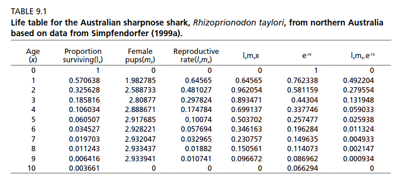

```{r setup, include=FALSE}
knitr::opts_chunk$set(echo = FALSE, warning = FALSE, message = FALSE)
pacman::p_load(phaseR, deSolve, plotly, tidyverse, plotly, kableExtra, tidygraph, ggraph, igraph)
```

# Modelos Matriciales

## Caso más simple: El salmón

i
```{r, out.width="30%", fig.align='center'}
DF <- data.frame(from = c(1,2,3,3), 
                   to = c(2,3,3,1),  
                   S = c(0.6, 0.1, 0, 0),
                   Fe = c(0,0,0,3)) %>% 
    mutate(Scaled_S = S/max(S),
           Scaled_Fe = Fe/max(Fe))

knitr::include_graphics("https://www.sciencemag.org/sites/default/files/styles/article_main_image_-_1280w__no_aspect_/public/salmon_16x9.jpg")
```


```{r}
Graph <- graph_from_data_frame(DF)
  
    ggraph(Graph, layout = 'linear')+
    geom_edge_link(aes(alpha = Scaled_S), color = "blue", arrow = arrow()) +
    annotate(x = 1.5 , y= 0.052, geom = "text", label= DF$S[1])+
    annotate(x = 2.5 , y= 0.052, geom = "text", label= DF$S[2])+
    annotate(x = 2 , y= -0.7, geom = "text", label=DF$Fe[4])+
    geom_edge_arc(aes(alpha = Scaled_Fe), color = "red", arrow = arrow()) +
    geom_node_point(size = 4)  +
    geom_node_label(aes(label = name)) +
    ggraph::theme_graph() + ggraph::scale_edge_alpha_continuous(range =c(0,1), guide = "none")

```


## Entendamos bien esto

```{r}
knitr::include_app("https://admin.ecoinformatica.net/shiny/rstudio/sample-apps/Ecologia/Matriciales/", height = "100%")
```

## Desde tabla de vida

```{r, out.width="80%", fig.align='center'}

```


## Algunos parámetros

* $\lambda$ = tasa de crecimiento (Eigenvalor dominante)
* Estructura de edad estable (Eigenvector izquierdo) 
* Valor reproductivo por edad (Eigenvector derecho) 


## Ciclos más complejos

```{r, out.width="80%", fig.align='center'}
knitr::include_graphics("https://upload.wikimedia.org/wikipedia/commons/thumb/4/4f/Life-cycle_graphs_%28matrix_population_models%29.pdf/page1-1200px-Life-cycle_graphs_%28matrix_population_models%29.pdf.jpg")
```

## Ciclos más complejos

```{r, out.width="80%", fig.align='center'}
knitr::include_graphics("https://kevintshoemaker.github.io/NRES-470/gotelli3_6.jpg")
```

## Elasticidad

* que parte del ciclo influencia más $\lambda$

# por que es importante?

## Ejemplo 1 sobrepoblación

<iframe src="https://ourworldindata.org/grapher/world-population-by-world-regions-post-1820" loading="lazy" style="width: 100%; height: 600px; border: 0px none;"></iframe>

## Grupos de edades estables

<iframe src="https://ourworldindata.org/grapher/population-by-broad-age-group?tab=chart&stackMode=relative&country=~CHL&region=World" loading="lazy" style="width: 100%; height: 600px; border: 0px none;"></iframe>

## Fertilidad por edad

<iframe src="https://ourworldindata.org/grapher/children-per-woman-UN?tab=chart&time=1950..latest&country=~OWID_WRL&region=World" loading="lazy" style="width: 100%; height: 600px; border: 0px none;"></iframe>

## Mortalidad infantil

<iframe src="https://ourworldindata.org/grapher/Children-woman-death-vs-survival?country=~CHL" loading="lazy" style="width: 100%; height: 600px; border: 0px none;"></iframe>

## Ejemplo 2 conservación (Tortugas marinas)

```{r, out.width="80%", fig.align='center'}
knitr::include_graphics("https://storage.googleapis.com/afs-prod/media/67627c7a9db3486a9330158dbdcfc4de/3000.jpeg")
```

## Fuentes de mortalidad

```{r, out.width="40%", fig.align='center'}
knitr::include_graphics("https://rs.projects-abroad.net/v1/hero/product-5c9a0a9462d0e.[1600].jpeg")
```


```{r, out.width="40%", fig.align='center'}
knitr::include_graphics("https://nationswell.com/wp-content/uploads/2019/08/Aryfahmed_turtlelede.jpg")
```

## Que es lo mejor

[ver tutorial](https://www.ecoinformatica.net/Modulo2.html)

* Learnr para aprender a hacer estos análisis en R
* Descubrir en que parte de la población hay que intervenir


# Depredador presa

## Ejemplo

```{r}
knitr::include_app("https://admin.ecoinformatica.net/shiny/rstudio/sample-apps/Ecologia/Matriciales/", height = "100%")
```

## seguir en la actividad anterior

* [ver tutorial](https://www.ecoinformatica.net/Modulo2.html)